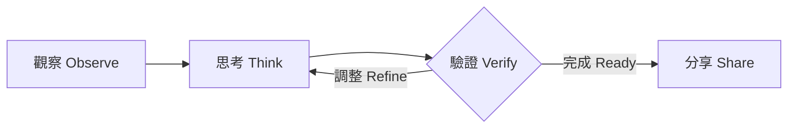
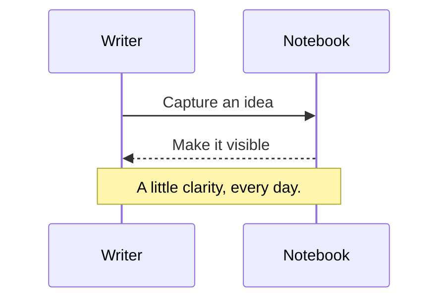
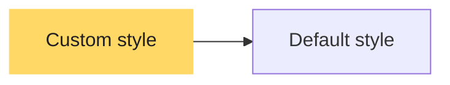

# Monokai Pro (CE) for Typora

留一點安靜，給正在成形的想法。

An independently maintained Community Edition for Typora, inspired by Monokai Pro. Warm charcoal, considered contrast, and a little color exactly where you need it.

## 01 — 閱讀與書寫

好讀的筆記，應該讓你忘記介面的存在。這份主題保留舒適的行距、清楚的標題層級，以及適合中文與 English 混排的字型。無論是在整理研究、閱讀文件，還是寫下一個尚未成熟的想法，都能把注意力留在內容。

**重點清楚，但不喧賓奪主。** *A quiet emphasis.* ~~已經不需要的想法。~~ 使用 `inline code` 標記程式名稱，或以 <mark>螢光標記</mark> 記下值得回頭看的句子。連結沿用溫暖的黃色：[Monokai Pro](https://monokai.pro/)。

> Color should help you understand, then get out of the way.
>
> 讓顏色幫助理解，讓文字成為主角。

### 寫下來，讓事情更清楚

- 留下問題的背景與假設。
- 把大問題拆成能夠驗證的小步驟。
  - 分清楚已知的事實。
  - 也保留仍待確認的部分。
- 回頭檢查推論，而不只是答案。

## 02 — 程式碼

六種色彩對應不同語意；文字與標點保持平衡，註解退後一階，仍然清楚可讀。

```javascript
// A small space for a better idea.
class Notebook {
  constructor(title = "A quiet workspace") {
    this.title = title;
    this.pages = 24;
  }

  write(thought) {
    const entry = { text: thought, starred: true };
    return `${this.title}: ${entry.text}`;
  }
}

const notebook = new Notebook();
console.log(notebook.write("Make room for what matters."));
```

```python
from dataclasses import dataclass

@dataclass
class Experiment:
    name: str
    samples: int = 128

    def progress(self, completed: int) -> float:
        """Return progress as a fraction between 0 and 1."""
        return min(completed / self.samples, 1.0)

print(Experiment("Reading rhythm").progress(96))
```

```css
:root {
  --background: #2d2a2e;
  --foreground: #fcfcfa;
}

.workspace:hover {
  color: var(--foreground);
  padding: 1.5rem;
}
```

```json
{
  "theme": "Monokai Pro (CE) for Typora",
  "offline": true,
  "pageWidth": 880,
  "dependencies": null
}
```

```diff
- const noise = "more decoration";
+ const focus = "more clarity";
```

## 03 — 表格與工作清單

| 色彩 | Hex | 用途 |
| :--- | :--- | :--- |
| Rose | `#ff6188` | 關鍵字、運算子 |
| Orange | `#fc9867` | 參數、特殊語法 |
| Yellow | `#ffd866` | 字串、連結、重點 |
| Green | `#a9dc76` | 宣告、函式與屬性標記 |
| Cyan | `#78dce8` | 型別、行內程式碼 |
| Purple | `#ab9df2` | 數字、常數 |

- [x] 為想法建立清楚的結構。
- [x] 把重要的細節寫下來。
- [ ] 給自己一點重新思考的空間。

按下 <kbd>⌘</kbd> + <kbd>F</kbd> 尋找文字，或透過「檢視」切換原始碼模式。

## 04 — 提示與引述

> [!NOTE]
> 補充背景，讓閱讀者理解接下來的內容。

> [!TIP]
> 可以先寫出最簡單的版本，再慢慢修整。

> [!IMPORTANT]
> 重要資訊需要被看見，也需要保持易讀。

> [!WARNING]
> 在進行下一步之前，先檢查這項假設。

> [!CAUTION]
> 這個範例用來檢查警示色與文字對比。

## 05 — 數學與圖表

行內公式 $e^{i\pi}+1=0$ 與內文共享相同的前景色。

$$
\operatorname{Attention}(Q,K,V)
=\operatorname{softmax}\left(\frac{QK^\top}{\sqrt{d_k}}\right)V
$$





### 保留圖表作者指定的色彩



## 06 — 層級、註腳與邊界情況

### 第三級標題 · A clear section

這是一段正常內文。註腳讓補充資料留在適當的位置，而不打斷閱讀。[^note]

#### 第四級標題 · A smaller thought

正文仍維持相同大小，避免在較深的標題層級中變得難以閱讀。

##### 第五級標題 · Supporting detail

降低明度，而不使用過小的字級。

###### 第六級標題 · A final detail

細節也應該清楚可辨。

1. 有序清單第一項。
2. 第二項包含一段程式碼：

   ```javascript
   const nested = { readable: true, depth: 2 };
   ```

3. 第三項回到正常的閱讀節奏。

> 外層引述。
>
> > 內層引述仍然保有可辨識的左側標記。

長網址：[https://example.com/research/notes/a-very-long-document-name-for-checking-responsive-layout-and-line-breaking](https://example.com/research/notes/a-very-long-document-name-for-checking-responsive-layout-and-line-breaking)

```text
This intentionally long line checks the code editor's own wrapping or horizontal scrolling behavior without changing the cursor geometry, breaking indentation, or clipping the language selector at the edge of the fence.
中文長行測試：保留程式碼縮排與游標定位，視窗縮小後仍應能捲動或依照 Typora 設定換行。
```

[TOC]

[^note]: 主題只調整外觀；Markdown 的編輯、公式運算與圖表渲染由 Typora 處理。

---

Keep your tools quiet. Let your ideas speak.
