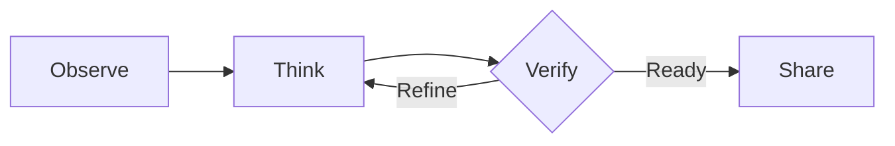
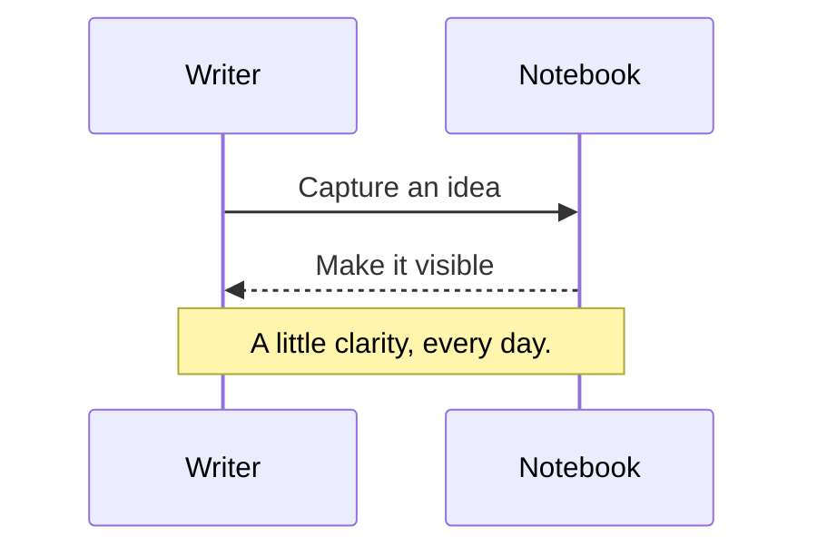
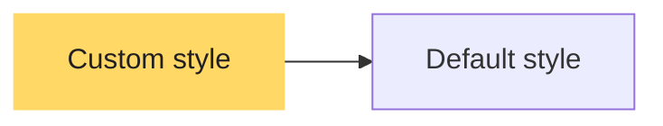

# Monokai Pro (CE) for Typora

A practical preview of typography, syntax colors, and Markdown elements.

An independently maintained Community Edition for Typora, using the default Monokai Pro palette.

## 01 — Reading and writing

Good notes keep your attention on the content. Comfortable line spacing, clear heading levels, and system fonts support research notes, technical documentation, and ideas that are still taking shape.

**Clear emphasis without distraction.** *A quiet emphasis.* ~~An idea no longer needed.~~ Use `inline code` for identifiers and <mark>highlighting</mark> for passages worth revisiting. Links use a warm yellow: [Monokai Pro](https://monokai.pro/).

> Color should help you understand, then get out of the way.
>
> Keep the words at the center of the page.

### Write it down to make it clear

- Record the context and assumptions.
- Break a large question into steps you can verify.
  - Identify the facts you know.
  - Keep track of what remains uncertain.
- Review the reasoning behind the answer.

## 02 — Code

Six accent colors distinguish syntax categories. Neutral text and punctuation balance the page, while comments remain readable in a quieter shade.

```javascript
// A small space for a better idea.
class Notebook {
  constructor(title = "A quiet workspace") {
    this.title = title;
    this.pages = 24;
  }

  write(thought) {
    const entry = { text: thought, starred: true };
    return `${this.title}: ${entry.text}`;
  }
}

const notebook = new Notebook();
console.log(notebook.write("Make room for what matters."));
```

```python
from dataclasses import dataclass

@dataclass
class Experiment:
    name: str
    samples: int = 128

    def progress(self, completed: int) -> float:
        """Return progress as a fraction between 0 and 1."""
        return min(completed / self.samples, 1.0)

print(Experiment("Reading rhythm").progress(96))
```

```css
:root {
  --background: #2d2a2e;
  --foreground: #fcfcfa;
}

.workspace:hover {
  color: var(--foreground);
  padding: 1.5rem;
}
```

```json
{
  "theme": "Monokai Pro (CE) for Typora",
  "offline": true,
  "pageWidth": 880,
  "dependencies": null
}
```

```diff
- const noise = "more decoration";
+ const focus = "more clarity";
```

## 03 — Tables and tasks

| Color | Hex | Typical use |
| :--- | :--- | :--- |
| Rose | `#ff6188` | Keywords and operators |
| Orange | `#fc9867` | Parameters and special syntax |
| Yellow | `#ffd866` | Strings, links, and highlights |
| Green | `#a9dc76` | Declarations, functions, and attributes |
| Cyan | `#78dce8` | Types and inline code |
| Purple | `#ab9df2` | Numbers and constants |

- [x] Give the idea a clear structure.
- [x] Record the important details.
- [ ] Leave room to reconsider.

Press <kbd>⌘</kbd> + <kbd>F</kbd> on macOS to find text, or use the View menu to switch to source mode.

## 04 — Alerts and quotations

> [!NOTE]
> Add context to help readers understand what follows.

> [!TIP]
> Start with the simplest useful version and refine it.

> [!IMPORTANT]
> Important information should stand out and remain readable.

> [!WARNING]
> Check this assumption before taking the next step.

> [!CAUTION]
> This example checks the warning color and text contrast.

## 05 — Math and diagrams

Inline math $e^{i\pi}+1=0$ shares the surrounding text color.

$$
\mathrm{Attention}(Q,K,V)
=\mathrm{softmax}\left(\frac{QK^\top}{\sqrt{d_k}}\right)V
$$





### Preserve custom diagram colors



## 06 — Headings, footnotes, and edge cases

### Level three · A clear section

This is a regular paragraph. Footnotes keep supporting material nearby without interrupting the reading flow.[^note]

#### Level four · A smaller thought

Body text keeps the same size beneath deeper heading levels.

##### Level five · Supporting detail

A quieter shade distinguishes the heading without making it too small.

###### Level six · A final detail

Even small details should remain clear.

1. The first item in an ordered list.
2. The second item includes a code block:

   ```javascript
   const nested = { readable: true, depth: 2 };
   ```

3. The third item returns to the regular reading flow.

> An outer quotation.
>
> > The nested quotation retains a distinct left border.

Long URL: [https://example.com/research/notes/a-very-long-document-name-for-checking-responsive-layout-and-line-breaking](https://example.com/research/notes/a-very-long-document-name-for-checking-responsive-layout-and-line-breaking)

```text
This intentionally long line checks the code editor's own wrapping or horizontal scrolling behavior without changing the cursor geometry, breaking indentation, or clipping the language selector at the edge of the fence.
Another long line checks that indentation and cursor positioning remain intact when the window narrows, with scrolling or wrapping controlled by Typora settings.
```

[TOC]

[^note]: The theme controls appearance. Typora handles Markdown editing, math typesetting, and diagram rendering.

---

## 07 — Mixed text and wide content

繁體中文與 English 混排：記錄研究筆記、API 設計與程式碼。標點符號（括號）、123.45、**粗體重點**與 `inline_code` 應清楚可辨，換行時也不應互相重疊。

同一段文字包含全形標點：「測試完成」，以及半形符號 (ready)、a/b、x = 42。縮小視窗後，檢查中文換行、段落邊界和文字選取。

| Case | Operating system | Editor | Source mode | Input sample | Expected result | Export check | Status |
| :--- | :--- | :--- | :--- | :--- | :--- | :--- | :--- |
| Mixed text | macOS / Windows / Linux | Paragraph and selection | Markdown delimiters | 繁體中文 + English + 123.45 | Readable glyphs and wrapping | No missing characters | Verify locally |
| Long content | Narrow and wide windows | Table and code fence | Long source lines | `long_identifier_with_underscores_0123456789` | Content remains reachable | No clipped columns | Verify locally |

$$
\text{A long expression: } S = a_1 + a_2 + a_3 + a_4 + a_5 + a_6 + a_7 + a_8 + a_9 + a_{10} + a_{11} + a_{12} + a_{13} + a_{14} + a_{15} + a_{16}
$$

### Manual checks

- Resize the window; inspect the wide table, long formula, and code lines.
- Edit a fenced code block: insert a tab, select text, and move the caret through a long line.
- Switch to source mode; check syntax colors, selection, and the caret.
- Open the outline and search for `Notebook`; check selected and inactive states.
- Export to PDF with this theme; inspect page breaks, all table columns, code line endings, and diagram labels.
